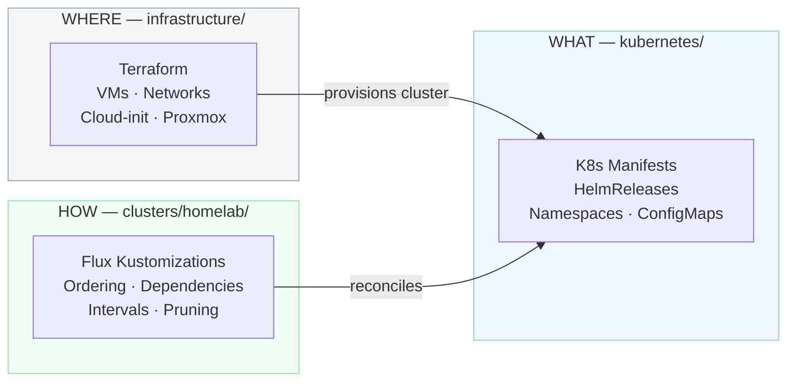
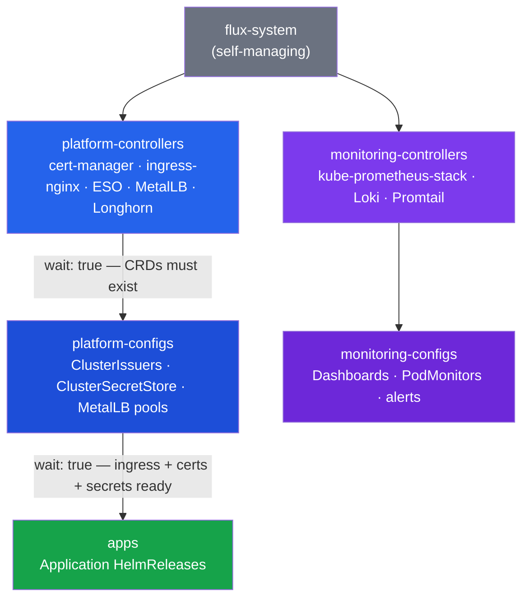

# Flux GitOps Structure

## Architecture Decision

**Decision:** Flux entry point lives at `clusters/homelab/`, separate from both Terraform (`infrastructure/`) and Kubernetes manifests (`kubernetes/`).

**Date:** 2026-02-16

## Why `clusters/<name>/` at root?

Three options were evaluated:

| Option | Location | Issue |
|--------|----------|-------|
| A | `infrastructure/flux/` | Mixes Terraform (VM provisioning) with Flux (K8s orchestration) — different tools, different layers |
| B | `kubernetes/flux/` | Circular — Flux lives inside the directory it manages; path references become awkward |
| **C** | **`clusters/homelab/`** | **Clean separation: each directory has a single responsibility** |

Option C follows the [official Flux community pattern](https://github.com/fluxcd/flux2-kustomize-helm-example) and the [Flux repository structure guide](https://fluxcd.io/flux/guides/repository-structure/).

### Separation of concerns



Each layer can be understood independently:
- **Terraform operators** work in `infrastructure/` without needing Flux knowledge
- **App developers** work in `kubernetes/apps/` without knowing Flux Kustomization details
- **Platform engineers** work in `clusters/homelab/` to control what gets deployed and when

### Multi-cluster readiness

Even with a single cluster today, `clusters/<name>/` scales naturally:

```
clusters/
├── homelab/        ← Production (current)
└── staging/       ← Future staging cluster (same kubernetes/ manifests, different config)
```

## Repository layout

```
homelab-iac/
├── clusters/
│   └── homelab/                              ← flux bootstrap --path=clusters/homelab
│       ├── flux-system/                     ← Auto-generated by flux bootstrap
│       │   ├── gotk-components.yaml         ← Flux CRDs + controller Deployments (~560KB)
│       │   ├── gotk-sync.yaml               ← GitRepository + root Kustomization
│       │   └── kustomization.yaml           ← Kustomize config for flux-system resources
│       ├── platform.yaml                    ← Kustomization → ./kubernetes/platform/{controllers,configs}
│       ├── apps.yaml                        ← Kustomization → ./kubernetes/apps
│       └── monitoring.yaml                  ← Kustomization → ./kubernetes/platform/monitoring/...
│
├── kubernetes/                              ← Pure K8s manifests (Flux reconciles these)
│   ├── apps/                                ← Application workloads
│   │   ├── podinfo/                         ← Test app (HelmRelease)
│   │   └── plex/                            ← Media server (HelmRelease)
│   └── platform/                            ← Infrastructure services
│       ├── controllers/                     ← cert-manager, ingress-nginx
│       ├── configs/                         ← ClusterIssuers, post-controller config
│       └── monitoring/                      ← Prometheus, Grafana, Loki
│           ├── controllers/                 ← HelmReleases for monitoring stack
│           └── configs/                     ← Dashboards, PodMonitors
│
├── infrastructure/                          ← Terraform only (no Flux files)
│   ├── main.tf
│   ├── backend.tf
│   └── modules/
│       ├── k3s/                             ← K3s cluster VMs + cloud-init
│       └── pve/                             ← Proxmox infrastructure queries
│
└── scripts/                                 ← Operational scripts
```

## Flux reconciliation chain

The dependency order ensures CRDs exist before resources that use them:



## Path references

All Flux Kustomization `path:` values are relative to the **repository root**, not relative to the Kustomization file:

```yaml
# clusters/homelab/platform.yaml
spec:
  path: ./kubernetes/platform/controllers    # ← relative to repo root
```

This is because the `GitRepository` source clones the entire repo, and all paths resolve from there.

## Key files

| File | Purpose |
|------|---------|
| `clusters/homelab/flux-system/gotk-sync.yaml` | Root GitRepository + Kustomization (auto-managed) |
| `clusters/homelab/platform.yaml` | Platform controllers + configs deployment order |
| `clusters/homelab/apps.yaml` | Application workloads (depends on platform) |
| `clusters/homelab/monitoring.yaml` | Monitoring stack (independent of apps) |
| `scripts/k8s/bootstrap-flux.sh` | Bootstrap script for initial Flux installation |

## References

- [Flux repository structure guide](https://fluxcd.io/flux/guides/repository-structure/)
- [flux2-kustomize-helm-example](https://github.com/fluxcd/flux2-kustomize-helm-example)
- [Flux bootstrap for GitHub](https://fluxcd.io/flux/installation/bootstrap/github/)
