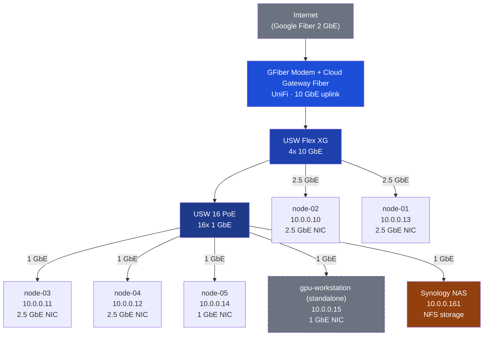
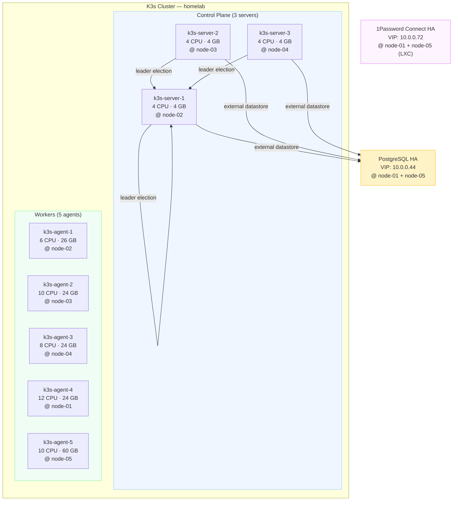

# Hardware Infrastructure

## Physical Network Topology

## Proxmox Cluster Topology

## Computers

| Model      | Vendor     | Cluster | CPU Model      | Cores/CPUs  | Ram   | GPU         | Type       | vRam | Network IC | Disk #1   | Disk #2  | Disk #3   | Disk #4 | Disk #5 |
| ---------- | ---------- | ------- | -------------- |:-----------:| ----- | ----------- | ---------- |:----:|:----------:| --------- | -------- | --------- | ------- | ------- |
| UM560 XT   | Minisforum | Yes     | Ryzen 5 5600H  | 6 / 12      | 32GiB | Radeon      | Integrated | N/A  | 2.5Gbps    | 512GB SSD |          |           |         |         |
| UM773 Lite | Minisforum | Yes     | Ryzen 7 7735HS | 8 / 16      | 32GiB | Radeon 680M | Integrated | N/A  | 2.5Gbps    | 1TB NVMe  |          |           |         |         |
| UM773 Lite | Minisforum | Yes     | Ryzen 7 7735HS | 8 / 16      | 32GiB | Radeon 680M | Integrated | N/A  | 2.5Gbps    | 1TB NVMe  |          |           |         |         |
| HX77G      | Minisforum | Yes     | Ryzen 7 7735HS | 8 / 16      | 32GiB | RX 6600M    | Dedicated  | 8GB  | 2.5Gbps    | 1TB NVMe  |          |           |         |         |
| NS-17      | Origin PC  | Yes     | i7-8700K       | 6 / 12      | 64GiB | GTX 1080    | Dedicated  | 8GB  | 1 Gbps     | 2TB NVMe  | 2TB NVMe | 500GB HDD | 2TB HDD |         |
| Custom     | DIY        | Yes (gpu-workstation) | i7-7820X  | 8 / 16      | 48GiB | RTX 3060    | Dedicated  | 8GB  | 1 Gbps     | 2TB NVMe  | 4TB SSD  | 250GB SSD | 4TB SSD | 1TB SSD |

## Networking

| Model               | Vendor | Downlink | WLAN Ports | 10GbE | 2.5GbE | 1GbE |
| ------------------- | ------ | -------- | ---------- | ----- | ------ | ---- |
| GFiber Modem        | Google | 2 GbE    | 1x2 GbE    | 1     | 0      |      |
| Cloud Gateway Fiber | UniFi  | N/A      | 2x10 GbE   | 1     | 4      |      |
| USW Flex XG         | UniFI  | N/A      | 2x10 GbE   | 4     |        | 1    |
| USW 16 PoE          | UniFI  | N/A      | 0          | 0     |        | 16   |

## Storage
