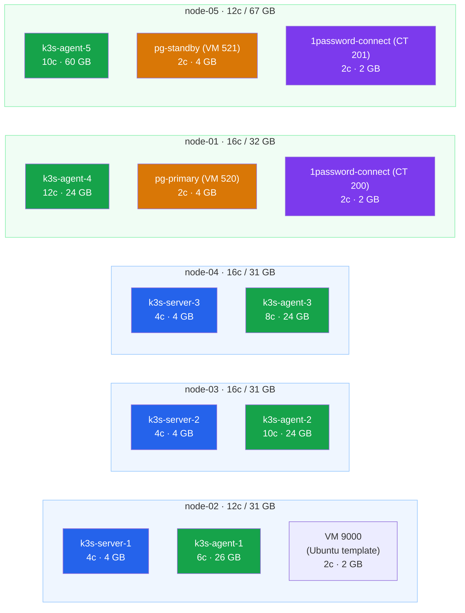

# Proxmox Node Hardware Config

## VM Distribution Across Nodes

| Node | Physical CPU | Physical RAM | Roles |
| ---- | ------------ | ------------ | ----- |
| node-02 | 12 cores | 31 GB | server + agent |
| node-03 | 16 cores | 31 GB | server + agent |
| node-04 | 16 cores | 31 GB | server + agent |
| node-01 | 16 cores | 32 GB | agent only |
| node-05 | 12 cores | 67 GB | agent only (+ GPU) |
| gpu-workstation | 16 cores | 48 GB | GPU compute VMs only (no K3s agent) — RTX 3060 passthrough (PCI `65:00.0/65:00.1`) + GTX 1080 Ti host display (`17:00.0`) |

Reserve ~2 cores and ~2 GB for the Proxmox host itself. Then split the rest between server VM + agent VM on the dual-role nodes.

Template (Guide 2 current specs): `2 CPU, 2GB RAM, ~2.5GB disk (cloud image size), local-lvm on node-02, VM ID 9000`

K3s clones override to:

- Servers: 4 CPU, 4GB RAM, 40GB disk
- Agents: 6 CPU, 8GB RAM, 80GB disk
- PostgreSQL: 2 CPU, 4GB RAM, 40GB OS + 100GB data disk

## Node Resource Allocation

|            | um560-xt-1       | um773-lite-1     | um773-lite-2     | hx77g-1          | originpc          | ai-1              |
| ---------- | ---------------- | ---------------- | ---------------- | ---------------- | ----------------- | ----------------- |
| Available  | 12core   30gb    | 16core   30gb    | 16core   30gb    | 16core   30gb    | 12core    62gb    | 14core    46gb    |
| Server     | CPU: 4   RAM: 4  | CPU: 4   RAM: 4  | CPU: 4   RAM: 4  |                  |                   |                   |
| Agent      | CPU: 6   RAM: 26 | CPU: 10  RAM: 24 | CPU: 8   RAM: 24 | CPU: 12  RAM: 24 | CPU: 10   RAM: 60 |                   |
| PostgreSQL |                  |                  |                  | CPU: 2   RAM: 4  |                   |                   |
| GPU VMs    |                  |                  |                  |                  |                   | (future AI VMs)   |
