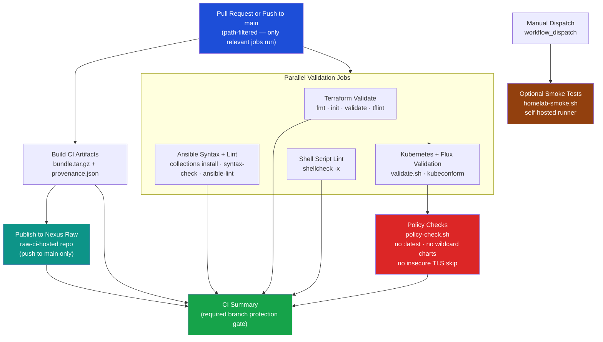

# CI/CD Testing Workflow

This guide describes the CI pipeline added for this repository, why each stage exists, and how to run the same checks locally.

## Goals

1. Catch infrastructure and manifest regressions before merge.
2. Keep runtime drift under control (images/charts).
3. Validate IaC across all project layers:
   - Terraform (`infrastructure/`)
   - Ansible (`ansible/`)
   - Flux + Kubernetes (`clusters/`, `kubernetes/`)
   - Shell automation (`scripts/`)
4. Support optional live smoke checks against the homelab from self-hosted runners.

## Pipeline Architecture



## Workflow File

- `.github/workflows/ci-testing.yml`

### Triggers

- `pull_request` to `main`
- `push` to `main`
- `workflow_dispatch` (manual run), including optional live smoke tests

### Concurrency

- Uses a per-branch concurrency group and cancels stale runs:
  - Faster feedback
  - Reduced duplicate CI resource usage

## Job-by-Job Breakdown

### 1) Detect Changed Areas

Tooling:

- `dorny/paths-filter`

Purpose:

- Avoid running expensive jobs when unrelated files changed.
- Outputs booleans for:
  - Terraform
  - Ansible
  - Kubernetes/Flux
  - Shell scripts
  - Docs/MCP config

### 2) Terraform Validate

Coverage:

- `terraform fmt -check -recursive`
- `terraform init -backend=false` and `terraform validate` for each directory with `.tf`
- `tflint` for each Terraform directory

Why:

- Catches syntax/provider/config issues early.
- Ensures all modules remain independently valid.

### 3) Ansible Syntax and Sanity

Coverage:

- Install collections used by playbooks:
  - `community.general`
  - `artis3n.tailscale`
  - `onepassword.connect`
- Syntax-check key playbooks:
  - `k3s-cluster.yml`
  - `k3s-upgrade.yml`
  - `pg-backup.yml`
- Run `ansible-lint` on playbooks/templates

Why:

- Prevents broken automation from merging.
- Guards upgrades/provisioning paths.

### 4) Kubernetes and Flux Validation

Coverage:

- Runs `scripts/k8s/validate.sh`, which:
  - validates YAML syntax with `yq`
  - validates Flux custom resources with `kubeconform`
  - builds and validates all kustomize overlays
- Runs policy checks:
  - `scripts/ci/policy-check.sh`

Why:

- This is the core GitOps safety gate.
- Prevents invalid manifests and broken overlays from reaching Flux.

### 5) Policy Checks (Drift Guardrails)

Files:

- `scripts/ci/policy-check.sh`
- `ci/allowlists/image-tag-latest.txt`
- `ci/allowlists/helm-wildcard-versions.txt`
- `ci/allowlists/kube-insecure-skip-tls-verify.txt`
- `ci/allowlists/ssh-strict-hostkeychecking-no.txt`
- `ci/allowlists/kubeconfig-mode-0644.txt`
- `ci/allowlists/terraform-insecure-true.txt`

Behavior:

- Fails only when **new** policy violations are introduced.
- Existing baseline entries are allowlisted so main is not broken immediately.

Checks enforced:

- Floating image tags (`:latest`, `*-latest`)
- Wildcard Helm chart versions (`*.x`)
- `insecure-skip-tls-verify: true` in kubeconfig templates
- `StrictHostKeyChecking=no` usage in automation
- `write-kubeconfig-mode: 0644` usage
- Terraform `insecure = true` usage

This provides incremental hardening:

- No surprise global breakage
- No further drift accumulation

### 6) Shell Script Lint

Coverage:

- Runs `shellcheck -x` on changed shell scripts from `dorny/paths-filter`
- Uses incremental enforcement to avoid blocking on pre-existing legacy lint debt

Why:

- Catches quoting/subshell/pipefail class bugs.
- Improves script reliability for operations runbooks.

### 7) Optional Homelab Smoke Tests (Manual, Self-Hosted)

Files:

- `scripts/ci/homelab-smoke.sh`
- job: `homelab_smoke`

Run mode:

- Only on `workflow_dispatch` with `run_homelab_smoke=true`
- Runs on labels: `[self-hosted, linux, homelab]`
- Optional auto-run on `push` to `main` for Kubernetes changes when repo variable `ENABLE_AUTO_SMOKE=true`

Checks:

- Cluster context and node readiness
- Required namespace presence
- Deployment/StatefulSet readiness in critical namespaces
- Flux status (if `flux` CLI exists)
- Ingress endpoint reachability checks (`curl -k`)

Why:

- Complements static validation with real environment checks when needed.
- Can be promoted from manual-only to post-merge gate by enabling `ENABLE_AUTO_SMOKE`.

### 8) Build CI Artifacts

Files:

- `scripts/ci/build-artifacts.sh`

Outputs:

- CI bundle archive (`.tar.gz`) containing:
  - `scripts/ci/`
  - `ci/allowlists/`
  - `.github/workflows/ci-testing.yml`
- Provenance JSON (`.provenance.json`) with:
  - commit SHA and ref
  - build timestamp (UTC)
  - workflow/run metadata

Why:

- Produces a reproducible artifact of CI policy and runner logic.
- Creates traceable metadata for audit/debug.

### 9) Publish CI Artifacts to Nexus (Raw)

Files:

- `scripts/ci/publish-nexus-raw.sh`

Run mode:

- `push` to `main` (when Nexus secrets are configured)
- `workflow_dispatch` (manual publish/testing)

Required secrets:

- `NEXUS_URL`
- `NEXUS_CI_USERNAME`
- `NEXUS_CI_PASSWORD`

Behavior:

- Uploads bundle + provenance files to `raw-ci-hosted` (or `vars.NEXUS_RAW_REPO` override).
- Stores artifacts under `homelab-iac/ci-bundles/<artifact-version>/`.

## Local Developer Parity

Run these locally before opening PRs:

```bash
# Terraform
terraform fmt -check -recursive infrastructure

# Flux/Kubernetes manifests
bash scripts/k8s/validate.sh
bash scripts/ci/policy-check.sh

# Build CI artifacts + provenance
ARTIFACT_VERSION=local-$(git rev-parse --short=7 HEAD) bash scripts/ci/build-artifacts.sh

# Shell scripts
find scripts -type f -name '*.sh' -print0 | xargs -0 -r shellcheck -x

# Ansible
ansible-playbook -i ansible/inventory/k3s.yml ansible/playbooks/k3s-cluster.yml --syntax-check
ansible-lint ansible/playbooks ansible/templates
```

## Draw.io MCP (Architecture Diagram Generation)

The repo ignores local `.mcp.json`, so Draw.io MCP is provided as a tracked example:

- `configs/mcp/drawio-mcp.example.json`

### Add to local `.mcp.json`

1. Open your local `.mcp.json`.
2. Merge the `drawio` server block from `configs/mcp/drawio-mcp.example.json`.
3. Restart your MCP-enabled client.

Example block:

```json
{
  "mcpServers": {
    "drawio": {
      "type": "stdio",
      "command": "npx",
      "args": ["-y", "drawio-mcp"],
      "env": {
        "DRAWIO_BASE_URL": "https://drawio.homelab.ts.net"
      }
    }
  }
}
```

### Suggested usage pattern

1. Use MCP to draft/update architecture flow for:
   - CI pipeline topology
   - Flux dependency flow
   - Secrets/data flow (1Password Connect -> ESO -> workloads)
2. Save exported diagram artifacts under:
   - `docs/architecture/`
3. Keep a markdown companion note describing assumptions and last validation date.

## Release Workflow (GitOps-First)

The repository now includes a manual release helper workflow:

- `.github/workflows/release-gitops-update.yml`
- helper script: `scripts/ci/gitops-image-update.sh`

Purpose:

- Update a Flux-managed manifest image reference.
- Optionally run `scripts/k8s/validate.sh`.
- Open a PR to `main` instead of deploying directly.

Example use cases:

- Bump `kubernetes/apps/n8n/deployment.yaml` to a new image tag.
- Update a HelmRelease `values.image.tag` in-place.

Workflow inputs:

- `manifest_file` (required, must be under `kubernetes/`)
- `image_reference` (required)
- `container_name` (optional; for multi-container workloads)
- `run_validation` (default: true)

## Operational Recommendations

1. Keep allowlists temporary and shrink over time.
2. Pin chart/image versions gradually, then tighten policy checks to fail on all floaters.
3. Add environment-specific workflows later:
   - `staging` dry-run reconciliation
   - `production` promotion gates
4. Add security scanning stage when ready:
   - IaC misconfiguration scanning
   - image vulnerability scanning for pinned tags

## References

- GitHub Actions: https://docs.github.com/actions
- Terraform validate: https://developer.hashicorp.com/terraform/cli/commands/validate
- TFLint: https://github.com/terraform-linters/tflint
- Ansible lint: https://ansible.readthedocs.io/projects/lint/
- Kustomize: https://kubectl.docs.kubernetes.io/references/kustomize/
- Kubeconform: https://github.com/yannh/kubeconform
- Flux docs: https://fluxcd.io/docs/
- MCP specification: https://modelcontextprotocol.io/
