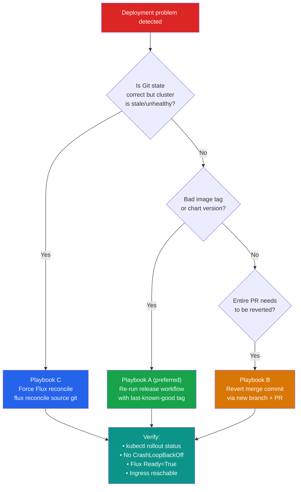

# GitOps Promotion and Rollback Workflow

This guide defines the release promotion model for this repository and the rollback procedures for failed deployments.

## Promotion Model (Single-Cluster, GitOps-First)

Current model uses one production cluster (`homelab`) with controlled promotion through Git:

```mermaid
flowchart LR
    DEV["Developer\nor Release Workflow"]
    PR["Pull Request\nupdates kubernetes/ manifest\n(image tag / chart version)"]
    CI["CI Pipeline\nci-testing.yml\nCI Summary gate (required)"]
    MAIN["main branch\n(Flux source of truth)"]
    FLUX["Flux GitOps\nreconciles desired state"]
    CLUSTER["K3s Cluster\nasgard"]
    SMOKE["Optional Smoke Test\nhomelab-smoke.sh\n(self-hosted runner)"]

    DEV -->|"git push feature branch"| PR
    PR -->|"must pass"| CI
    CI -->|"merge"| MAIN
    MAIN -->|"GitRepository poll / webhook"| FLUX
    FLUX -->|"HelmRelease / kustomize apply"| CLUSTER
    CLUSTER -.->|"ENABLE_AUTO_SMOKE=true"| SMOKE

    style CI fill:#2563eb,color:#fff
    style FLUX fill:#7c3aed,color:#fff
    style CLUSTER fill:#16a34a,color:#fff
    style SMOKE fill:#92400e,color:#fff
```



**Rule:** No direct `kubectl apply` or `helm install` in production. All changes go through Git.

1. **Change proposal**: release workflow creates a PR that updates image references in `kubernetes/` manifests.
2. **Validation gate**: required check `CI Summary` must pass on the PR.
3. **Promotion**: merge PR to `main` (single source of truth for Flux).
4. **Reconciliation**: Flux applies the new desired state from Git.

This is a `PR -> main -> Flux` promotion lane (no direct cluster mutation from CI).

## Deployment Verification Gates

Required/available gates:

- `CI Summary` (required via branch protection on `main`)
- Manifest update workflow validation (`scripts/k8s/validate.sh`)
- Optional homelab smoke gate:
  - Enable repo variable `ENABLE_AUTO_SMOKE=true` to run `scripts/ci/homelab-smoke.sh` automatically on `main` pushes with Kubernetes changes.
  - Leave unset/false to keep smoke checks manual-only.

## Release Entry Points

### 1) Manual release PR workflow

- Workflow: `.github/workflows/release-gitops-update.yml`
- Inputs: `manifest_file`, `image_reference`, optional `container_name`, `run_validation`

### 2) Direct Git PR changes

Standard PRs that update manifests directly are also valid, provided all gates pass.

## Rollback Playbooks



### Playbook A: Fast image rollback (preferred)

1. Identify last known-good image tag/digest.
2. Re-run `Release - GitOps Manifest Update` with that image.
3. Merge rollback PR after checks pass.
4. Verify workload readiness and service access.

### Playbook B: Revert bad release commit

1. Find the bad merge commit on `main`.
2. Revert it in a new branch:

```bash
git switch main
git pull --ff-only
git switch -c rollback/<short-reason>
git revert <bad-commit-sha>
```

3. Open PR and merge after CI passes.

### Playbook C: Controller-level reconcile recovery

If Git is correct but cluster is stale/unhealthy:

```bash
flux get kustomizations -A
flux reconcile source git flux-system -n flux-system
flux reconcile kustomization apps -n flux-system
kubectl get pods -A
```

## Post-Rollback Verification Checklist

- Workload rollout status is healthy (`kubectl rollout status ...`)
- No CrashLoopBackOff for target namespace
- Ingress/service endpoint is reachable
- Flux `Ready=True` for impacted Kustomizations

## Notes

- Keep rollbacks as Git changes for auditable history.
- Prefer digest-pinned image references for deterministic recovery.
- If enabling auto smoke gates, ensure self-hosted runner availability to avoid blocking promotions.
