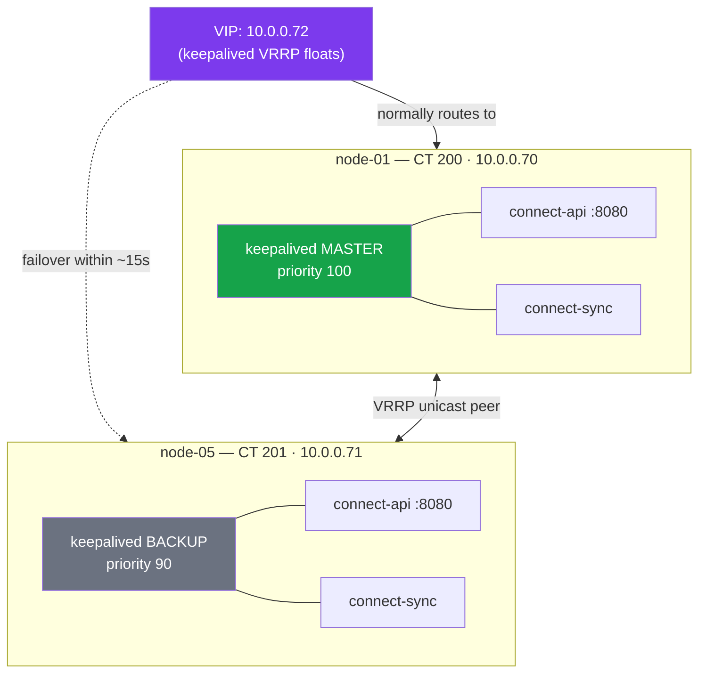

Integration patterns for 1Password across the homelab stack: Terraform, Ansible, External Secrets Operator, CLI, and SSH agent.

## Connect Server (HA)

1Password Connect runs as an HA pair of Proxmox LXC containers with keepalived VIP failover.

**Architecture:**



**Endpoint:** `http://10.0.0.72:8080` (VIP) — used by both Terraform and Kubernetes.

**Failover:** Keepalived monitors `/heartbeat` every 5s. If Connect goes down on the MASTER, the VIP floats to the BACKUP within ~15s. VRRP uses unicast peers (reliable in LXC environments).

**Boot order:** LXC containers start at order 1, before K3s VMs (which depend on Connect for secrets).

**Vault access:**
- Homelab vault (`e2xu6xow3lm3xssqph2jftrny4`) -- accessible via Connect token
- Dev vault (`qxhlzrgegpplamzkgg7kuxnhmm`) -- NOT accessible via Connect token

The Connect token only grants access to the Homelab vault. ESO ClusterSecretStore configurations must reference Homelab only.

### REST API Quick Reference

```
GET  /heartbeat                                    # No auth
GET  /health                                       # No auth
GET  /v1/vaults                                    # List vaults
GET  /v1/vaults/{id}/items                         # List items
GET  /v1/vaults/{id}/items/{id}                    # Get item
POST /v1/vaults/{id}/items                         # Create item
PUT  /v1/vaults/{id}/items/{id}                    # Replace item
GET  /metrics                                      # Prometheus metrics
```

Auth header: `Authorization: Bearer <CONNECT_TOKEN>`

## HA Design Rationale

### Why Not Inside K3s?

Running 1Password Connect inside the K3s cluster creates a circular dependency:

1. ESO needs Connect to sync Secrets
2. Connect needs a K8s Secret for its credentials file
3. If the Connect pod restarts and the credentials Secret is missing, Connect cannot start
4. If Connect cannot start, ESO cannot create any Secrets (including Connect's own)

Running Connect on Proxmox LXC (external to K3s) avoids this entirely:

- **Independent lifecycle:** Connect starts with the Proxmox host, before K3s boots
- **No K8s dependency:** Connect does not need K8s Secrets or pod scheduling
- **Higher availability:** LXC containers survive K3s cluster maintenance, upgrades, and failures
- **Terraform-managed:** `infrastructure/modules/op-connect/` defines the full deployment

### Terraform Module

The `op-connect` module creates 2 privileged LXC containers (Docker-in-LXC) with:

- `proxmox_virtual_environment_container` for each node
- `null_resource` provisioners for Docker CE + keepalived + Connect setup
- Keepalived VRRP with `/heartbeat` health checks and unicast peers
- Boot order 1 (before K3s VMs at default order)

**Manual prerequisite:** Store base64-encoded `1password-credentials.json` in the `1Password-Connect-Server` item (Homelab vault, section `server`, field `credentials-b64`).

### Outage Impact Matrix

| Component | Connect Up | Connect Down |
|-----------|-----------|-------------|
| Existing K8s Secrets | Synced at refresh interval | Unchanged, pods use cached Secret |
| New ExternalSecrets | Created normally | Stuck in `SecretSyncedError` until Connect returns |
| Terraform plan/apply | Reads credentials normally | Fails at provider initialization |
| Secret rotation | Applied at next refresh | Delayed until Connect returns |

## Terraform Provider

Provider: `1Password/onepassword` v3.2.1, configured in Connect mode.

```hcl
provider "onepassword" {
  connect_url   = var.op_connect_host  # http://10.0.0.72:8080 (VIP)
  connect_token = var.op_connect_token
}
```

Data sources read Proxmox credentials and SSH keys from 1Password, eliminating `TF_VAR_` secrets from the environment. The Connect token itself is the only secret in `.env.d/terraform.env`.

## Ansible Integration

### Lookup Plugin: `community.general.onepassword`

- **Collection:** `community.general` (v8.1.0+ for Connect mode)
- **Plugin type:** Lookup (works inline in group_vars, templates, Jinja2)
- **Connect mode:** No `op` CLI needed -- talks directly to Connect server
- **Install:** `ansible-galaxy collection install community.general`

**Syntax:**

```yaml
"{{ lookup('community.general.onepassword', '<item-name>',
          field='<field-label>', vault='<vault-name>') }}"
```

**Parameters:**

| Param | Default | Notes |
|---|---|---|
| `_terms` (positional) | -- | Item name or UUID (required) |
| `field` | `"password"` | Field label (case-insensitive) |
| `section` | -- | Section containing the field |
| `vault` | -- | Vault name/UUID |
| `connect_host` | `$OP_CONNECT_HOST` | Connect server URL |
| `connect_token` | `$OP_CONNECT_TOKEN` | Connect JWT |
| `service_account_token` | `$OP_SERVICE_ACCOUNT_TOKEN` | Alt to Connect |

**Related plugins:**
- `community.general.onepassword_raw` -- returns entire item as dict
- `community.general.onepassword_doc` -- retrieves stored documents

### Common Mistake: `onepassword.connect.item_info`

`onepassword.connect.item_info` is a **module**, not a lookup plugin. The `onepassword.connect` collection has no lookup plugins. Modules require `register:` + task flow and cannot be used in group_vars.

Only use the `onepassword.connect` collection when CRUD operations (create/update/delete items) are needed:
- `onepassword.connect.field_info` -- read single field
- `onepassword.connect.item_info` -- read full item
- `onepassword.connect.generic_item` -- CRUD operations

## Secrets Data Flow

How secrets travel from 1Password vaults into running pods:

```mermaid
flowchart LR
    subgraph OP["1Password Cloud"]
        VAULT["Homelab Vault\ncustom text fields only"]
    end

    subgraph LXC["Proxmox LXC (HA pair)"]
        CONNECT["1Password Connect\nVIP: 10.0.0.72:8080\nlocal cache + REST API"]
    end

    subgraph K8S["K3s Cluster"]
        ESO["External Secrets Operator\nClusterSecretStore\nonepassword-connect"]
        ES["ExternalSecret CR\nrefreshInterval: 1h"]
        SECRET["Kubernetes Secret\n(owned by ESO)"]
        POD["Application Pod\nmounts Secret as env / volume"]
    end

    VAULT -->|"Connect sync\n(pull)"| CONNECT
    CONNECT -->|"REST API\nBearer token"| ESO
    ESO -->|"reconciles"| ES
    ES -->|"creates/updates"| SECRET
    SECRET -->|"secretKeyRef /\nvolumeMount"| POD

    style VAULT fill:#0f172a,color:#fff
    style CONNECT fill:#7c3aed,color:#fff
    style ESO fill:#2563eb,color:#fff
    style ES fill:#1d4ed8,color:#fff
    style SECRET fill:#16a34a,color:#fff
    style POD fill:#0d9488,color:#fff
```



**Key constraint:** The `key` in an `ExternalSecret` `remoteRef` is the 1Password item *title*; `property` is the custom *field label*. Default Login fields (username, password) are NOT addressable by `property` — always create custom text fields.

## External Secrets Operator (ESO)

### API Versions

- **Current stable:** `external-secrets.io/v1` (for all resources)
- **Deprecated:** `v1beta1` -- not served by default since ESO v2.0.0
- **PushSecret:** still `external-secrets.io/v1alpha1`

### Connect Provider (`onepassword`)

```yaml
spec:
  provider:
    onepassword:
      connectHost: <url>
      vaults:
        Homelab: 1              # map of name: priority (integer)
      auth:
        secretRef:
          connectTokenSecretRef:
            name: <secret-name>
            key: <key>
```

**remoteRef format:**
- `key` = item title
- `property` = field label
- These are separate fields (not a path)

**Requirement:** Connect server v1.5.6+

### SDK Provider (`onepasswordSDK`)

```yaml
spec:
  provider:
    onepasswordSDK:
      vault: Homelab             # single vault (string, not map)
      auth:
        serviceAccountSecretRef:
          name: <secret-name>
          key: <key>
          namespace: <ns>        # required for ClusterSecretStore
      cache:
        ttl: 5m
        maxSize: 100
```

**remoteRef format:**
- `key` = `<item>/<field>` or `<item>/<section>/<field>` (single path string)
- No separate `property` field
- For OTP: append `?attribute=otp`

### Key Differences Between Providers

| Aspect | Connect (`onepassword`) | SDK (`onepasswordSDK`) |
|---|---|---|
| Infrastructure | Requires Connect server | No server needed |
| Auth | Connect JWT token | Service account token |
| Vault config | `vaults` (plural, map with priority) | `vault` (singular, string) |
| remoteRef | `key` + `property` (separate) | `key` as path `item/field` |
| Rate limits | Unlimited (local cache) | Cloud rate limits |
| Multi-vault | Yes (priority ordering) | One store per vault |

### Helm Chart

- **Repo URL:** `https://charts.external-secrets.io`
- **Chart name:** `external-secrets`
- **CRD control:** `installCRDs: true` (camelCase, NOT `crds.create`)
- **Individual CRD toggles:** `crds.createClusterSecretStore`, `crds.createSecretStore`, etc.
- **v1beta1 compat:** `crds.unsafeServeV1Beta1: false` (default: disabled)
- CRDs require server-side apply (Helm handles this automatically)
- ESO chart ships CRDs via Helm **templates** (not the `crds/` directory). In Flux HelmRelease, use `install.crds: Skip` + `upgrade.crds: Skip` and let the chart's `installCRDs: true` default handle CRDs.

## SSH Agent with Ansible

### Problem: "Too many authentication failures"

The 1Password SSH agent serves ALL keys in the vault. When the agent has 6+ keys and SSH tries each one sequentially, the server's `MaxAuthTries` (default 6) is exhausted before the correct key is offered, resulting in `Received disconnect: Too many authentication failures`.

### Solution: IdentitiesOnly + Public Key File

1. Extract the public key from the agent to a file:

   ```bash
   SSH_AUTH_SOCK=~/.1password/agent.sock ssh-add -L | grep homelab-k3s-cluster > ansible/.ssh/k3s-cluster.pub
   ```

2. Use `-o IdentitiesOnly=yes -i <pubkey>` in SSH args. SSH matches the public key against the agent's keys and only offers that one, bypassing `MaxAuthTries`.

3. The public key is NOT sensitive -- safe to commit to the repo.

### Ansible Inventory Config

```yaml
vars:
  ansible_ssh_private_key_file: "{{ inventory_dir }}/../.ssh/k3s-cluster.pub"
  ansible_ssh_common_args: "-o StrictHostKeyChecking=no -o IdentitiesOnly=yes"
```

Use `inventory_dir` (not `playbook_dir`) for relative paths in inventory files. `playbook_dir` is only available during playbook execution, not ad-hoc commands.

### 1Password Agent Approval Prompt

The agent prompts for approval on each SSH connection. With Ansible's default `forks=5`, parallel connections overwhelm the approval dialog and most connections get "agent refused operation".

**Fix:** Use `--forks=1` to serialize connections, or configure 1Password to auto-approve for the `homelab-k3s-cluster` key.

### Agent Key Pinning (agent.toml)

By default, the 1Password SSH agent offers ALL SSH keys stored in the vault. When there are many keys, this exhausts the server's `MaxAuthTries` before reaching the correct key. Beyond using `IdentitiesOnly` on the client side, the agent itself can be configured to limit which keys it offers.

Configuration file: `~/.config/1Password/ssh/agent.toml`

```toml
[[ssh-keys]]
item = "homelab-k3s-cluster"
vault = "Homelab"
```

Each `[[ssh-keys]]` entry pins a specific key by item name (or UUID) and vault. When `[[ssh-keys]]` sections are present, the agent ONLY offers those keys -- all other SSH keys in the vault are excluded from agent operations. This is the server-side complement to the client-side `IdentitiesOnly=yes` approach.

The `item` field accepts:

- Item title (e.g., `"homelab-k3s-cluster"`)
- Item UUID (e.g., `"j23jpbwjm2gzxtht7hezuf4ili"`)

### Environment Setup

Set in `.env.d/base.env`:

```bash
export SSH_AUTH_SOCK=~/.1password/agent.sock
```

## CLI Usage

Create items:

```bash
op item create --vault Homelab --category login --title "<name>" username=<user> --generate-password
```

Validate an item exists:

```bash
op item get --vault Homelab <item_name>
```

Retrieve a concealed field value (add `--reveal`):

```bash
op item get --vault Homelab <item_name> --field <field_name> --reveal
```

**Note:** Without `--reveal`, `op item get --field` returns a placeholder for concealed fields.

When using `op` CLI in scripts alongside a Connect environment, unset Connect variables to avoid mode conflict:

```bash
env -u OP_CONNECT_HOST -u OP_CONNECT_TOKEN op item get ...
```

Connect mode does not support `--field` / `--reveal`.

## Gotchas

| Gotcha | Detail |
|---|---|
| Connect cannot access Personal/Private vaults | Only dedicated shared vaults are supported |
| `op run` only resolves env vars | Command arguments are NOT resolved |
| `op inject` uses double braces | `{{ op://... }}` (not bare `op://`) |
| Terraform state contains plaintext secrets | `onepassword_item` data source values are stored in state |
| `terraform destroy` deletes `onepassword_item` resources | Use `prevent_destroy` lifecycle rule |
| Service account tokens can expire | `--expires-in` flag; plan for rotation |
| Connect tokens don't expire by default | But can be revoked |
| ESO + Connect resilience | If Connect goes down, new secrets fail but existing K8s Secrets persist |
| Default Login fields not addressable by ESO | `username`, `password`, `URL` fields on Login items cannot be referenced by `property` in ExternalSecrets; use custom text fields |
| Auth modes are mutually exclusive | Connect and Service Account modes cannot be active simultaneously; unset `OP_SERVICE_ACCOUNT_TOKEN` when using Connect |
| Credentials file needs `644` not `600` | Connect containers run as `opuser` (UID 999); a `600`-permission credentials file is unreadable. Use `chmod 644` for the credentials JSON |
| Data directory ownership | The Connect data directory must be owned by UID 999 (`opuser`) or Connect fails to start with permission errors. Run `chown 999:999 /opt/op-connect/data` |
| Cache may not immediately reflect new items | Newly created 1Password items may not be visible via Connect cache. Force ExternalSecret re-sync with annotation `force-sync=$(date +%s)` |

## Implementation Priority

For a new deployment, implement in this order (required first, easiest to test, least rollback risk):

1. **CLI** -- Already functional. Validate only.
2. **Terraform data sources** -- Read-only. Test with `terraform plan`. Rollback: delete HCL.
3. **Ansible lookup** -- Standalone. Test with `ansible -m debug`. Rollback: revert group_vars.
4. **ESO in K8s** -- Requires running cluster. Rollback: `helm uninstall`.
5. **Connect in K8s** -- Deploy last or not at all. Circular dependency risk. Keep Connect external.
