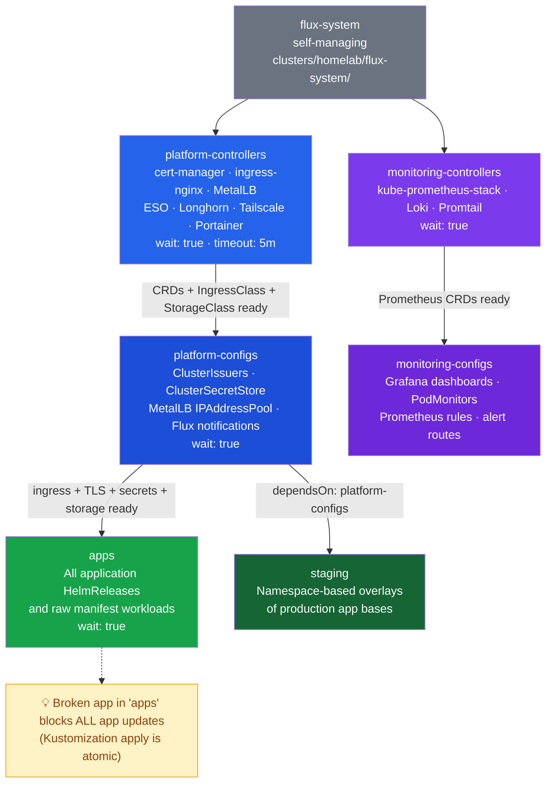
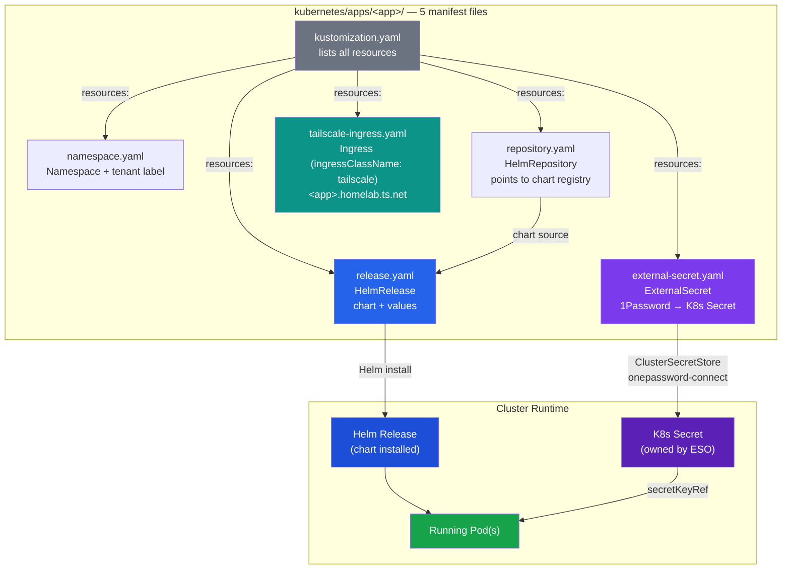

Patterns and conventions for deploying applications and platform services via Flux GitOps in the homelab K3s cluster.

## Reconciliation Dependency Chain

Flux Kustomizations enforce an ordering that ensures CRDs and platform controllers are healthy before apps deploy. The dependency chain is defined in `clusters/homelab/`:



**Why ordering matters for storage:** Platform controllers like Longhorn must be fully reconciled (StorageClass created, CSI driver running) before apps that use `storageClassName: longhorn` in their PVCs can be scheduled. Without `wait: true` on `platform-controllers`, Flux may attempt to create app PVCs before the StorageClass exists, causing `ProvisioningFailed` events.

### Key Kustomization settings

| Setting | Value | Purpose |
|---------|-------|---------|
| `wait: true` | platform-controllers, apps | Block downstream until all resources are Ready |
| `retryInterval: 1m` | platform-controllers | Retry quickly on transient failures |
| `timeout: 5m` | most Kustomizations | Fail fast if a HelmRelease is stuck |
| `prune: true` | all | Remove resources deleted from Git |

## Standard App Pattern (Helm-based)

Helm-based applications follow a consistent 5-file pattern under `kubernetes/apps/<app-name>/`:



```
kubernetes/apps/<app-name>/
  namespace.yaml           # Namespace with optional tenant label
  repository.yaml          # HelmRepository source
  external-secret.yaml     # ExternalSecret for credentials (optional)
  release.yaml             # HelmRelease with chart values
  tailscale-ingress.yaml   # Tailscale Ingress for remote access
  kustomization.yaml       # Kustomize resource list
```

### namespace.yaml

```yaml
apiVersion: v1
kind: Namespace
metadata:
  name: <app-name>
  labels:
    toolkit.fluxcd.io/tenant: dev-team    # Optional: multi-tenancy label
```

### repository.yaml

```yaml
apiVersion: source.toolkit.fluxcd.io/v1
kind: HelmRepository
metadata:
  name: <repo-name>
  namespace: <app-name>
spec:
  interval: 24h
  url: <chart-repo-url>
```

### external-secret.yaml

```yaml
apiVersion: external-secrets.io/v1
kind: ExternalSecret
metadata:
  name: <app>-secrets
  namespace: <app-name>
spec:
  refreshInterval: 1h
  secretStoreRef:
    name: onepassword-connect
    kind: ClusterSecretStore
  target:
    name: <app>-secrets
    creationPolicy: Owner
  data:
    - secretKey: <k8s-secret-key>
      remoteRef:
        key: <1password-item-title>
        property: <1password-field-label>
```

**Important:** The `key` is the 1Password item title; `property` is the custom field label. Default Login fields (username, password) are NOT addressable by `property` -- always create custom text fields in 1Password.

### release.yaml

```yaml
apiVersion: helm.toolkit.fluxcd.io/v2
kind: HelmRelease
metadata:
  name: <app-name>
  namespace: <app-name>
spec:
  interval: 50m
  install:
    remediation:
      retries: 3
  chart:
    spec:
      chart: <chart-name>
      version: "<major>.x"        # Pin major, float minor/patch
      sourceRef:
        kind: HelmRepository
        name: <repo-name>
        namespace: <app-name>
      interval: 12h
  values:
    # App-specific Helm values here
```

### tailscale-ingress.yaml

```yaml
apiVersion: networking.k8s.io/v1
kind: Ingress
metadata:
  name: <app>-tailscale
  namespace: <app-name>
spec:
  ingressClassName: tailscale
  defaultBackend:
    service:
      name: <service-name>
      port:
        number: <port>
  tls:
    - hosts:
        - <app-name>              # Becomes <app-name>.homelab.ts.net
```

### kustomization.yaml

```yaml
apiVersion: kustomize.config.k8s.io/v1beta1
kind: Kustomization
namespace: <app-name>
resources:
  - namespace.yaml
  - repository.yaml
  - external-secret.yaml          # Omit if no secrets needed
  - release.yaml
  - tailscale-ingress.yaml
```

## Raw Manifest Pattern

When Helm charts have broken repos or are over-complex for the use case, raw manifests are used instead:

```
kubernetes/apps/<app-name>/
  namespace.yaml
  external-secret.yaml
  deployment.yaml (or statefulset.yaml)
  service.yaml
  pvc.yaml
  ingress.yaml               # nginx LAN ingress
  tailscale-ingress.yaml     # Tailscale remote ingress
  kustomization.yaml
```

Apps using this pattern: code-server, n8n, JupyterLab, Wiki.js, YouTrack, TeamCity, Docmost.

## Registering a New App

After creating the app directory under `kubernetes/apps/<app-name>/`, add it to the apps kustomization:

```yaml
# kubernetes/apps/kustomization.yaml
resources:
  - ./<app-name>
```

The `apps` Flux Kustomization (defined in `clusters/homelab/apps.yaml`) already points at `./kubernetes/apps` and will pick up any new entries in this kustomization automatically on the next reconciliation cycle.

## Platform Controller Pattern

Platform controllers live in `kubernetes/platform/controllers/` as single-file HelmReleases (namespace + HelmRepository + HelmRelease in one YAML document). They are reconciled by the `platform-controllers` Kustomization with `wait: true`, which means all controllers must report Ready before `platform-configs` begins.

Current platform controllers:

| Controller | Chart | Namespace | Creates |
|------------|-------|-----------|---------|
| cert-manager | 1.x | cert-manager | Certificate, ClusterIssuer CRDs |
| ingress-nginx | 4.x | ingress-nginx | IngressClass `nginx` |
| MetalLB | 0.x | metallb-system | IPAddressPool, L2Advertisement CRDs |
| NFS provisioner | 4.x | nfs-provisioner | StorageClass `nfs-kubernetes` |
| Tailscale operator | 1.x | tailscale | IngressClass `tailscale` |
| ESO | 1.x | external-secrets | ExternalSecret, ClusterSecretStore CRDs |
| Longhorn | 1.x | longhorn-system | StorageClass `longhorn` |
| Portainer | 2.x | portainer | (no CRDs) |
| Keycloak | -- | keycloak | (no CRDs) |
| OAuth2 Proxy | 7.x | oauth2-proxy | (no CRDs) |

## Flux Notification-Controller (v1beta3)

Flux notification-controller provides real-time event forwarding to external systems. The homelab uses `notification.toolkit.fluxcd.io/v1beta3` API for Slack notifications on error events.

### Provider + Alert Pattern

```yaml
# Provider — defines the Slack destination
apiVersion: notification.toolkit.fluxcd.io/v1beta3
kind: Provider
metadata:
  name: slack
  namespace: flux-system
spec:
  type: slack
  channel: homelab-alerts
  secretRef:
    name: flux-slack-webhook    # Secret must have key "address"
```

```yaml
# Alert — subscribes to error events from all Flux resource types
apiVersion: notification.toolkit.fluxcd.io/v1beta3
kind: Alert
metadata:
  name: flux-errors-slack
  namespace: flux-system
spec:
  providerRef:
    name: slack
  eventSeverity: error
  eventSources:
    - kind: Kustomization
      name: "*"
    - kind: HelmRelease
      name: "*"
    - kind: HelmRepository
      name: "*"
    - kind: GitRepository
      name: "*"
    - kind: HelmChart
      name: "*"
```

### Key Details

- **API version:** `v1beta3` is the current stable API. Earlier versions (`v1beta1`, `v1beta2`) are deprecated.
- **Secret key convention:** The Provider expects the webhook URL in a Secret key named `address` (not `webhook-url` or `url`).
- **Error-only by design:** With 20+ HelmReleases reconciling hourly, info-level events create excessive noise. Use `eventSeverity: error` and optionally add `inclusionList` for specific info-level resources.
- **Namespace:** Provider and Alert MUST live in `flux-system` namespace (where notification-controller runs). Placing them under `monitoring/configs/` would apply a `namespace: monitoring` transformer, breaking them.
- **Placement:** Deployed via `kubernetes/platform/configs/flux-notifications/` (under platform-configs, not monitoring-configs).

See [cicd-observability.md](./cicd-observability.md) for the full CI/CD monitoring stack including dashboards and alert rules.

## Kustomization Atomicity

Flux Kustomization reconciliation is **atomic**: if any single resource in a Kustomization fails server-side dry-run or apply, the entire Kustomization is blocked. No resources are applied, even those that are perfectly valid. This has important implications:

### Impact

- A single invalid manifest (e.g., a PVC with a schema error) prevents ALL other apps in the same Kustomization from reconciling
- The `apps` Kustomization covers all applications -- one broken app blocks every other app's updates
- This applies to both `kustomize build` validation failures and server-side apply rejections

### Common Triggers

| Trigger | Symptom | Resolution |
|---------|---------|------------|
| Dynamically provisioned PVC missing `volumeName` | Dry-run fails with "spec is immutable" | Add `volumeName: <pv-name>` to PVC manifest after binding |
| PV with immutable field change (e.g., `nfs.path`) | Apply fails with "field is immutable" | Delete PV + PVC, let Flux recreate |
| CRD not yet available | "no matches for kind" | Fix dependency chain (controller must reconcile before config) |
| Invalid label or annotation | Validation error | Fix the invalid metadata |

### Mitigation Strategies

1. **Pin PVC `volumeName` after binding:** Once a dynamically provisioned PVC is bound, add the PV name to the manifest to prevent dry-run conflicts
2. **Delete and recreate for immutable changes:** PV `spec` fields cannot be updated in-place; delete the PV and PVC (data on NFS is unaffected) and let Flux recreate
3. **Temporarily remove broken resources:** If a fix requires investigation, comment out the resource from `kustomization.yaml` to unblock the rest
4. **PV/PVC finalizer deadlock:** Protection finalizers can prevent deletion; patch to remove: `kubectl patch pv <name> -p '{"metadata":{"finalizers":null}}'`

See [deployment-troubleshooting.md](./deployment-troubleshooting.md) for detailed troubleshooting entries.

## Staging Environment (Namespace-Based Overlays)

A lightweight staging environment runs on the same K3s cluster as production, using separate namespaces (`<app>-staging`) and Kustomize overlays over the production app bases. Full walkthrough: `docs/guides/staging-environment.md`.

### Architecture

```
kubernetes/
  apps/            <- production bases (unchanged)
    n8n/           <- namespace=n8n, host=n8n.10.0.0.201.nip.io
  staging/         <- staging overlays
    n8n/           <- namespace=n8n-staging, host=n8n-staging.10.0.0.201.nip.io

clusters/homelab/
  apps.yaml        <- existing, reconciles kubernetes/apps
  staging.yaml     <- new, reconciles kubernetes/staging (depends on platform-configs)
```

### Entry Point

`clusters/homelab/staging.yaml` defines the staging Flux Kustomization:

- `spec.path: ./kubernetes/staging`
- `spec.dependsOn: platform-configs` (needs ESO + ingress-nginx + cert-manager)
- `spec.interval: 10m`
- `spec.prune: true` (removing from `kubernetes/staging/kustomization.yaml` deletes the namespace)

### Activating an App in Staging

1. Create `kubernetes/staging/<app>/kustomization.yaml` (overlay referencing `../../apps/<app>`)
2. Add `- ./<app>` to `kubernetes/staging/kustomization.yaml`
3. Validate: `kubectl kustomize kubernetes/staging/<app>`
4. Commit and push -- Flux picks up within 10 minutes

Force immediate reconcile:

```bash
flux reconcile kustomization staging --with-source
```

### Standard Overlay Patches

| Patch | Required | Purpose |
|-------|----------|---------|
| `namespace: <app>-staging` | Yes | Overrides `metadata.namespace` on all namespaced resources |
| Rename Namespace resource (`metadata.name`) | Yes | The `namespace:` field above does not rename the Namespace resource itself |
| Ingress hostname (`spec.rules[0].host`) | If app has ingress | Separate staging hostname |
| Ingress TLS (`spec.tls[0]`) | If app has TLS ingress | Separate cert for staging hostname |
| Remove OAuth2 annotations | Optional | Skip Keycloak auth when testing |
| Remove Tailscale ingress | Optional | Save Tailscale operator quota |
| Reduce replicas/resources | Optional | Lower footprint for staging |

### Key Notes

- Staging overlays share the same 1Password items as production by default (same ExternalSecret `remoteRef`). Patch the ExternalSecret if staging-specific secrets are needed.
- The `namespace: <app>-staging` field in the overlay kustomization patches `metadata.namespace` on namespaced resources, but does NOT rename the `Namespace` resource itself -- that requires an explicit JSON patch on `metadata.name`.
- JSON patch path tilde-encoding: `/` becomes `~1`, `~` becomes `~0` (e.g., annotation key `nginx.ingress.kubernetes.io/auth-url` becomes `nginx.ingress.kubernetes.io~1auth-url` in the path).

## Key Files

| File | Purpose |
|------|---------|
| `clusters/homelab/platform.yaml` | Defines platform-controllers and platform-configs Kustomizations |
| `clusters/homelab/apps.yaml` | Defines apps Kustomization (depends on platform-configs) |
| `clusters/homelab/staging.yaml` | Defines staging Kustomization (depends on platform-configs) |
| `clusters/homelab/monitoring.yaml` | Defines monitoring Kustomizations |
| `kubernetes/apps/kustomization.yaml` | Master list of enabled apps |
| `kubernetes/staging/kustomization.yaml` | Master list of active staging overlays |
| `kubernetes/platform/controllers/kustomization.yaml` | Master list of platform controllers |
| `kubernetes/platform/configs/kustomization.yaml` | Master list of platform configs |
| `kubernetes/platform/configs/flux-notifications/` | Flux Slack notification Provider + Alert |
