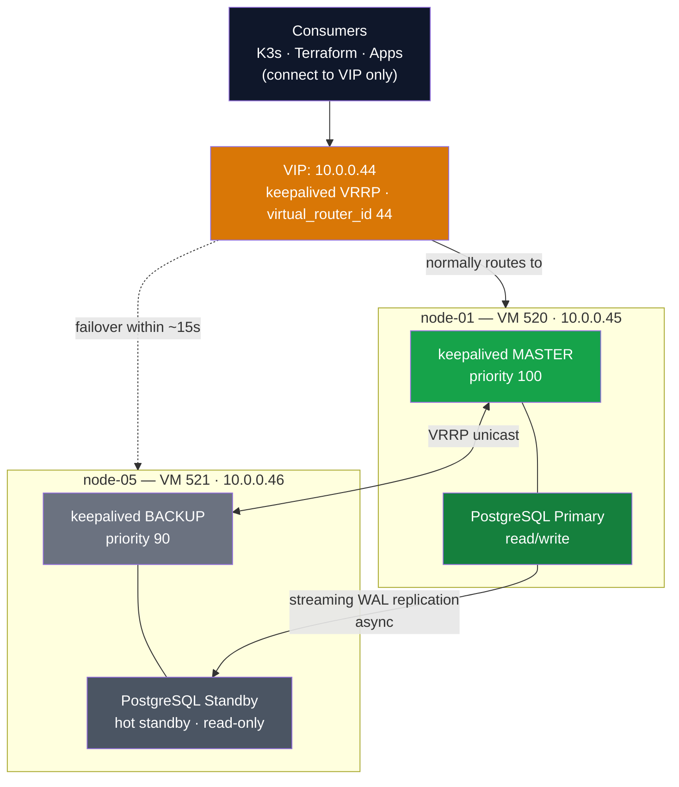
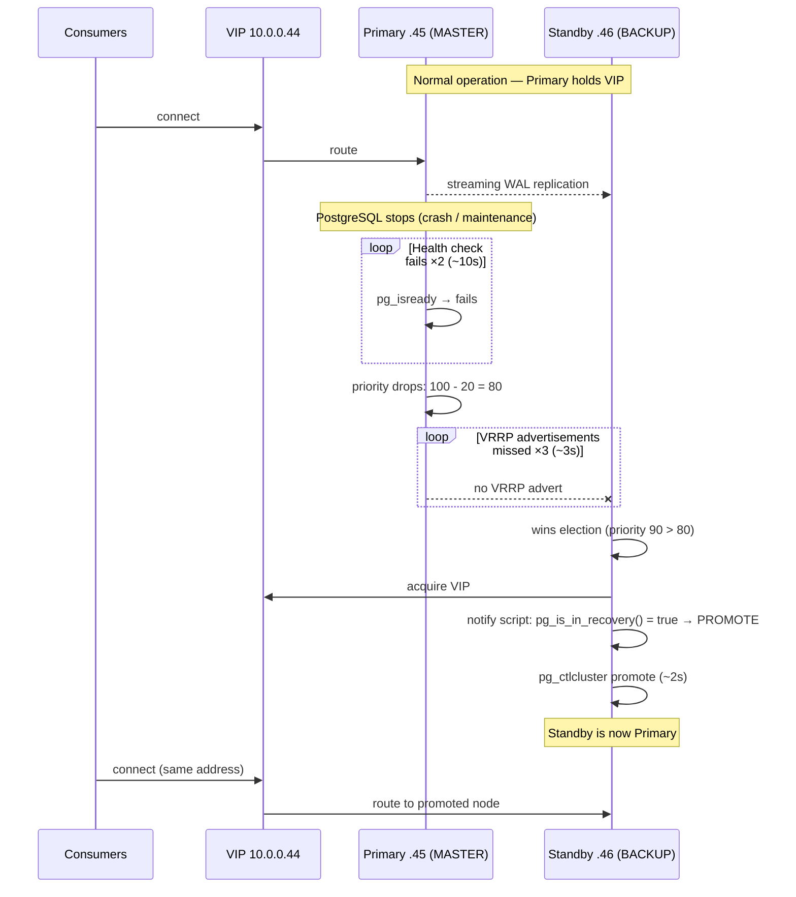

Architecture, configuration, and operational procedures for the PostgreSQL HA cluster with keepalived VIP failover.

## Architecture

The PostgreSQL HA cluster uses streaming replication with keepalived for automatic VIP failover. Consumers connect to the VIP, which floats between the primary and standby nodes.



**Module:** `infrastructure/modules/pg-ha/`

### VM Specifications

| Property | Primary (VM 520) | Standby (VM 521) |
|----------|-----------------|------------------|
| Proxmox node | node-01 | node-05 |
| IP address | 10.0.0.45 | 10.0.0.46 |
| CPU | 2 cores | 2 cores |
| Memory | 4096 MB | 4096 MB |
| OS disk | 40 GB (scsi0) | 40 GB (scsi0) |
| Data disk | 100 GB (scsi1) | 100 GB (scsi1) |
| Keepalived state | MASTER | BACKUP |
| Keepalived priority | 100 | 90 |

### Databases Hosted

All application databases reside on this cluster:

| Database | Consumer |
|----------|----------|
| `k3s` | K3s datastore (etcd replacement) |
| `terraform_state` | Terraform remote backend |
| `keycloak` | Keycloak identity provider |
| `n8n` | n8n workflow automation |
| `wikijs` | Wiki.js knowledge base |
| `teamcity` | TeamCity CI/CD server |
| `coder` | Coder remote development |
| `windmill` | Windmill workflow automation |

## Replication

The cluster uses PostgreSQL asynchronous streaming replication. The standby continuously receives WAL (Write-Ahead Log) records from the primary and replays them.

**Replication user:** `replicator` (dedicated role with `REPLICATION` privilege)

**Replication configuration on primary (`postgresql.conf`):**
- `wal_level = replica`
- `max_wal_senders = 10`
- `wal_keep_size = 1GB`

**Replication configuration on standby:**
- `primary_conninfo` in `postgresql.auto.conf` (set by `pg_basebackup`)
- Hot standby enabled: standby accepts read-only queries

**`pg_hba.conf` on primary:**
```
host    replication     replicator      10.0.0.46/32         md5
host    all             all             10.0.0.0/24          md5
```

The `10.0.0.0/24` entry allows K8s pod connections, which route via node IPs (not pod CIDR 10.42.0.0/16).

### Verifying Replication

```bash
# On primary: check connected standbys
sudo -u postgres psql -c "SELECT pid, application_name, client_addr, state, sent_lsn, replay_lsn FROM pg_stat_replication;"

# On standby: confirm recovery mode
sudo -u postgres psql -tAc "SELECT pg_is_in_recovery();"
# Expected: t (true)

# Check replication lag
sudo -u postgres psql -c "SELECT now() - pg_last_xact_replay_timestamp() AS replication_lag;"
```

## Keepalived (VIP Failover)

Keepalived manages the floating VIP (10.0.0.44) using VRRP with unicast peers. When the primary's PostgreSQL becomes unreachable, keepalived transitions the VIP to the standby and triggers promotion.

### VRRP Configuration

| Parameter | Value | Notes |
|-----------|-------|-------|
| `virtual_router_id` | 44 | Must be unique on the subnet (1-255) |
| `advert_int` | 1 second | VRRP advertisement interval |
| `authentication` | PASS | Simple password auth (not security-critical on LAN) |
| `unicast_src_ip` | Node's real IP | Required for reliable VRRP in virtualized environments |
| `unicast_peer` | Other node's IP | Point-to-point, no multicast dependency |
| `interface` | `eth0` | Ubuntu 24.04 cloud images with virtio NICs use `eth0`, not `ens18` |

### Health Check Script

The health check (`/usr/local/bin/pg-health-check.sh`) tests only whether PostgreSQL is accepting connections:

```bash
#!/bin/bash
pg_isready -q || exit 1
exit 0
```

The `vrrp_script` configuration:
- **interval:** 5 seconds
- **weight:** -20 (must exceed priority gap of 10 between MASTER and BACKUP)
- **fall:** 2 (2 consecutive failures to mark down)
- **rise:** 2 (2 consecutive successes to mark up)

**Critical design decision:** The health check only runs `pg_isready`. It does NOT check `pg_is_in_recovery()`. Checking recovery status in the health check creates a deadlock where the standby can never win the VRRP election because it always fails the "is primary" check, dropping its effective priority below the failed primary's priority.

### Notify Script (Promotion)

The notify script (`/usr/local/bin/keepalived-notify.sh`) runs on VRRP state transitions:

```bash
#!/bin/bash
TYPE=$1   # INSTANCE
NAME=$2   # VI_POSTGRES
STATE=$3  # MASTER|BACKUP|FAULT

case $STATE in
  MASTER)
    if sudo -u postgres psql -tAc "SELECT pg_is_in_recovery();" 2>/dev/null | grep -q "t"; then
      PG_VERSION=$(pg_lsclusters -h | awk '{print $1}')
      sudo -u postgres pg_ctlcluster "$PG_VERSION" main promote
      logger "keepalived: PostgreSQL PROMOTED to primary"
    else
      logger "keepalived: PostgreSQL already primary, VIP acquired"
    fi
    ;;
  BACKUP|FAULT)
    logger "keepalived: PostgreSQL entering $STATE state"
    ;;
esac
```

**Behavior:** When a node transitions to MASTER, the script checks if PostgreSQL is in recovery (standby). If so, it promotes PostgreSQL to primary. If PostgreSQL is already primary (e.g., the original primary reclaims VIP), the script only logs the event.

### Failover Timing

With the current configuration, total failover takes approximately 15 seconds:

| Phase | Duration | Description |
|-------|----------|-------------|
| Health check failure detection | ~10s | 2 failed checks at 5s interval |
| VRRP advertisement timeout | ~3s | 3 missed advertisements at 1s interval |
| PostgreSQL promotion | ~2s | WAL replay + timeline switch |



## Operational Procedures

### Checking Cluster Health

```bash
# Check VIP is reachable
pg_isready -h 10.0.0.44 -p 5432

# Check individual nodes
pg_isready -h 10.0.0.45 -p 5432   # Primary
pg_isready -h 10.0.0.46 -p 5432   # Standby

# Check which node holds the VIP
ssh k3sadmin@10.0.0.45 "ip addr show eth0 | grep 10.0.0.44"
ssh k3sadmin@10.0.0.46 "ip addr show eth0 | grep 10.0.0.44"

# Check keepalived status
ssh k3sadmin@10.0.0.45 "sudo systemctl status keepalived"
ssh k3sadmin@10.0.0.46 "sudo systemctl status keepalived"

# Check replication status (from primary)
ssh k3sadmin@10.0.0.45 "sudo -u postgres psql -c 'SELECT * FROM pg_stat_replication;'"
```

### Testing Failover

1. **Verify starting state:** Primary on 10.0.0.45, VIP on 10.0.0.45, standby on 10.0.0.46 in recovery.

2. **Trigger failover:** Stop PostgreSQL on the primary:
   ```bash
   ssh k3sadmin@10.0.0.45 "sudo systemctl stop postgresql"
   ```

3. **Observe failover:** Within ~15 seconds:
   - Keepalived on the primary detects health check failure (priority drops 100-20=80)
   - Standby keepalived (priority 90) wins VRRP election
   - VIP moves to 10.0.0.46
   - Notify script promotes standby to primary

4. **Verify:**
   ```bash
   # VIP should respond on standby
   pg_isready -h 10.0.0.44 -p 5432

   # Standby should no longer be in recovery
   ssh k3sadmin@10.0.0.46 "sudo -u postgres psql -tAc 'SELECT pg_is_in_recovery();'"
   # Expected: f (false, now primary)
   ```

### Restoring the Original Primary as Standby

After a failover, the old primary must be re-initialized as a standby before it can rejoin the cluster. PostgreSQL promotion is irreversible -- you cannot simply restart the old primary and have it resume as standby.

```bash
# 1. Stop PostgreSQL on the old primary (10.0.0.45)
ssh k3sadmin@10.0.0.45 "sudo systemctl stop postgresql"

# 2. Get the PostgreSQL version
ssh k3sadmin@10.0.0.45 "pg_lsclusters -h"
# Note the version number (e.g., 16)

# 3. Remove old data and re-initialize from new primary (10.0.0.46)
ssh k3sadmin@10.0.0.45 "
  PG_VERSION=16
  sudo systemctl stop postgresql
  sudo -u postgres rm -rf /var/lib/postgresql/\$PG_VERSION/main/*
  sudo -u postgres pg_basebackup -h 10.0.0.46 -U replicator -D /var/lib/postgresql/\$PG_VERSION/main -Fp -Xs -P --checkpoint=fast
  sudo systemctl start postgresql
"

# 4. Verify new standby is in recovery
ssh k3sadmin@10.0.0.45 "sudo -u postgres psql -tAc 'SELECT pg_is_in_recovery();'"
# Expected: t (true, now standby)
```

**Important:** Use `--checkpoint=fast` with `pg_basebackup` to avoid waiting up to 5 minutes for a scheduled checkpoint.

### VIP Cutover Procedure (Consumer Migration)

When migrating consumers from direct IP (10.0.0.45) to the VIP (10.0.0.44), update these in order:

1. **Terraform backend** (`infrastructure/backend.tf`):
   - Change `conn_str` from `10.0.0.45` to `10.0.0.44`
   - Run `terraform init -migrate-state` to update the backend configuration

2. **K3s datastore endpoint** (`ansible/inventory/group_vars/k3s_cluster.yml`):
   - Change the `--datastore-endpoint` value to use VIP
   - Rolling restart of K3s servers (one at a time)

3. **Application connection URLs** (1Password items):
   - Update `db-connection-url` fields in: Keycloak, n8n, Wiki.js, TeamCity, Coder, Windmill
   - Force ExternalSecret re-sync: `kubectl annotate es <name> -n <namespace> force-sync=$(date +%s)`

4. **Verify all consumers** are connected to VIP:
   ```bash
   # On VIP holder: check active connections
   sudo -u postgres psql -c "SELECT datname, usename, client_addr FROM pg_stat_activity WHERE state = 'active';"
   ```

### Considerations for Production

- **`nopreempt`:** Consider adding `nopreempt` to the MASTER keepalived config. This prevents the original primary from automatically reclaiming the VIP after it recovers, which avoids an unnecessary VIP migration (and brief connection interruption) when the old primary comes back online. Without `nopreempt`, the higher-priority node always reclaims the VIP once healthy.

- **Synchronous replication:** The current setup uses asynchronous replication. For zero data loss guarantees, set `synchronous_standby_names` on the primary. Trade-off: write latency increases by the round-trip time to the standby.

- **Monitoring:** Add Prometheus monitoring for replication lag, WAL sender status, and keepalived state transitions. The `pg_stat_replication` and `pg_stat_wal_receiver` views provide the necessary metrics.

## Backup Automation

The PostgreSQL HA cluster uses a two-tier backup strategy for defense-in-depth. See [backup-strategy.md](./backup-strategy.md) for the complete strategy overview.

### Tier 2: VM-Level Per-Database Backups

Deployed via Ansible (`ansible-playbook playbooks/pg-backup.yml`), this tier runs directly on both PG HA nodes and provides per-database `pg_dump` backups with NAS offloading.

**VIP guard pattern:** The backup cron job is installed on BOTH nodes (primary and standby), but the backup script checks whether the VIP (10.0.0.44) is assigned to the local node before executing. Only the current VIP holder (the active primary) runs the actual dumps. After a failover, the promoted standby automatically starts backing up on the next cron cycle with no manual intervention.

```bash
# VIP guard: only back up on the current primary
if ! ip addr show | grep -q "${VIP}"; then
    log "Not VIP holder. Skipping backup."
    exit 0
fi
```

**Configuration** (from `ansible/inventory/group_vars/pg_nodes.yml`):

| Parameter | Value | Notes |
|-----------|-------|-------|
| Schedule | `0 */6 * * *` | Every 6 hours |
| Local retention | 7 days | On-disk at `/var/backups/postgresql` |
| NAS retention | 30 days | On Synology NAS at `/volume1/postgresql-backups` |
| NFS mount options | `nofail,soft,timeo=30,retrans=3` | Prevents boot hang if NAS is down |
| NAS mount point | `/mnt/nas-backups` | Mounted via fstab on both nodes |

**Databases backed up:** k3s, terraform_state, keycloak, n8n, wikijs, teamcity, coder, windmill

**NFS mount in cloud-init:** Since cloud-init's `write_files` module does not support append mode and `/etc/fstab.d/` does not exist on Ubuntu, the NFS fstab entry is added via `runcmd`:

```yaml
runcmd:
  - |
    mkdir -p /mnt/nas-backups
    echo "10.0.0.161:/volume1/postgresql-backups /mnt/nas-backups nfs defaults,nofail,soft,timeo=30,retrans=3 0 0" >> /etc/fstab
    mount -a || true
```

**Status file:** Each backup run writes a JSON status file (`/var/backups/postgresql/backup-status.json`) with per-database results, NAS sync status, and any errors. This enables ad-hoc inspection without parsing logs.

### Verifying Backups

```bash
# Check recent backup status on the VIP holder
ssh k3sadmin@10.0.0.44 "cat /var/backups/postgresql/backup-status.json | python3 -m json.tool"

# List local backups
ssh k3sadmin@10.0.0.44 "ls -lh /var/backups/postgresql/*.sql.gz | tail -10"

# Check NAS backups
ssh k3sadmin@10.0.0.44 "ls -lh /mnt/nas-backups/\$(hostname)/*.sql.gz | tail -10"

# Check cron log
ssh k3sadmin@10.0.0.44 "tail -50 /var/log/pg-backup.log"

# Run backup manually
ssh k3sadmin@10.0.0.44 "sudo /usr/local/bin/backup-pg-dbs.sh"
```

## MCP Server Access

A read-only PostgreSQL user (`mcp_readonly`) is configured for the [Model Context Protocol (MCP)](https://modelcontextprotocol.io/) PostgreSQL server, allowing AI coding assistants (Claude Code, Coder agents) to query database schemas and data without write risk.

### Read-Only User Setup

The `mcp_readonly` user has `SELECT`-only access across all application databases:

```sql
-- Create the read-only role (run on VIP holder as postgres superuser)
CREATE USER mcp_readonly WITH ENCRYPTED PASSWORD '<password>';

-- Grant connect + read on each database
-- Repeat for: k3s, terraform_state, keycloak, n8n, wikijs, teamcity, coder, windmill
\c <database>
GRANT CONNECT ON DATABASE <database> TO mcp_readonly;
GRANT USAGE ON SCHEMA public TO mcp_readonly;
GRANT SELECT ON ALL TABLES IN SCHEMA public TO mcp_readonly;
ALTER DEFAULT PRIVILEGES IN SCHEMA public GRANT SELECT ON TABLES TO mcp_readonly;
```

**Credential storage:** 1Password item in the Homelab vault. The connection string is used directly in `.mcp.json`.

### MCP Server Configuration

The PostgreSQL MCP server is configured in `.mcp.json` at the repo root:

```json
{
  "postgres": {
    "type": "stdio",
    "command": "npx",
    "args": ["-y", "@modelcontextprotocol/server-postgres",
             "postgresql://mcp_readonly:<password>@10.0.0.44:5432/postgres"]
  }
}
```

**Key points:**

- Connects via the VIP (10.0.0.44), so it automatically follows failover
- Uses the `postgres` database as the entry point (can query across all databases via fully-qualified names)
- Read-only by design -- the user has no INSERT, UPDATE, DELETE, or DDL permissions

### Prometheus MCP Server

A Prometheus MCP server is also configured for AI-assisted metric queries. It requires Prometheus to be accessible over Tailscale, which is enabled via a dedicated Tailscale Ingress resource:

**File:** `kubernetes/platform/configs/prometheus-tailscale-ingress.yaml`

```yaml
apiVersion: networking.k8s.io/v1
kind: Ingress
metadata:
  name: prometheus-tailscale
  namespace: monitoring
spec:
  ingressClassName: tailscale
  defaultBackend:
    service:
      name: kube-prometheus-stack-prometheus
      port:
        number: 9090
  tls:
    - hosts:
        - prometheus
```

This exposes Prometheus at `https://prometheus.homelab.ts.net` -- accessible from any Tailscale device but not the public internet. The MCP server configuration in `.mcp.json`:

```json
{
  "prometheus": {
    "type": "stdio",
    "command": "npx",
    "args": ["-y", "prometheus-mcp@latest", "stdio"],
    "env": {
      "PROMETHEUS_URL": "https://prometheus.homelab.ts.net"
    }
  }
}
```

### Other MCP Servers Configured

The full `.mcp.json` includes these additional servers:

| MCP Server | Purpose | Connection |
|------------|---------|------------|
| `context7` | Library documentation lookup | `@upstash/context7-mcp` (cloud API) |
| `github` | GitHub API access (issues, PRs, code search) | HTTP proxy via `api.githubcopilot.com` |
| `kubernetes` | kubectl operations via MCP tools | Local kubeconfig |
| `terraform` | Terraform registry lookups | Local binary (`terraform-mcp-server`) |
| `flux` | Flux CD status and operations (read-only) | Local binary (`flux-operator-mcp`) |

## Gotchas

These are also documented in [technical-gotchas.md](./technical-gotchas.md) and [deployment-troubleshooting.md](./deployment-troubleshooting.md).

| Gotcha | Details |
|--------|---------|
| Health check must NOT check `pg_is_in_recovery()` | Creates a deadlock where the standby can never win the VRRP election |
| Install keepalived on MASTER first | If BACKUP starts alone, it becomes MASTER within ~3s and triggers irreversible promotion |
| `pg_basebackup` needs `--checkpoint=fast` | Default waits for scheduled checkpoint (up to 5 minutes) |
| Interface is `eth0`, not `ens18` | Ubuntu 24.04 cloud images with virtio NICs lack predictable naming metadata |
| Pod traffic routes via node IP | `pg_hba.conf` needs `10.0.0.0/24`, not the pod CIDR `10.42.0.0/16` |
| Passwords with special chars in connection URLs | Must be URL-encoded; simplest approach: use alphanumeric passwords |
| PostgreSQL promotion is irreversible | After failover, the old primary must be fully re-initialized via `pg_basebackup` |
| cloud-init fstab append | `/etc/fstab.d/` does not exist on Ubuntu; `write_files` does not support append; use `runcmd` with `echo >> /etc/fstab` |
| NFS mount options for backups | Use `nofail,soft,timeo=30,retrans=3` to prevent boot hangs and indefinite NFS waits |
| `pg_hba.conf` NOT replicated | Changes to `pg_hba.conf` (new users, new CIDR entries) are NOT replicated to the standby via streaming replication. WAL replication only covers data pages, not config files. | After editing `pg_hba.conf` on the primary, manually apply the same change on the standby and run `SELECT pg_reload_conf();` on each node. |

## Key Files

| File | Purpose |
|------|---------|
| `infrastructure/modules/pg-ha/pg-ha-cluster.tf` | VM resources, cloud-config snippets, locals |
| `infrastructure/modules/pg-ha/variables.tf` | Module inputs (credentials, VIP, network) |
| `infrastructure/modules/pg-ha/outputs.tf` | VIP, connection string, health check commands |
| `infrastructure/modules/pg-ha/cloud-configs/postgresql-primary.yml.tftpl` | Primary cloud-init (PG config, keepalived MASTER, backup script) |
| `infrastructure/modules/pg-ha/cloud-configs/postgresql-standby.yml.tftpl` | Standby cloud-init (pg_basebackup, keepalived BACKUP, backup script) |
| `infrastructure/modules/pg-ha/scripts/pg-health-check.sh` | Keepalived health check (pg_isready only) |
| `infrastructure/modules/pg-ha/scripts/keepalived-notify.sh` | VRRP state transition handler (promotion logic) |
| `ansible/playbooks/pg-backup.yml` | Backup automation deployment playbook |
| `ansible/templates/backup-pg-dbs.sh.j2` | Backup script template (Jinja2) |
| `ansible/inventory/group_vars/pg_nodes.yml` | Backup configuration variables |
| `kubernetes/platform/monitoring/controllers/pg-backup/cronjob.yaml` | Tier 1: K8s CronJob for pg_dumpall |
