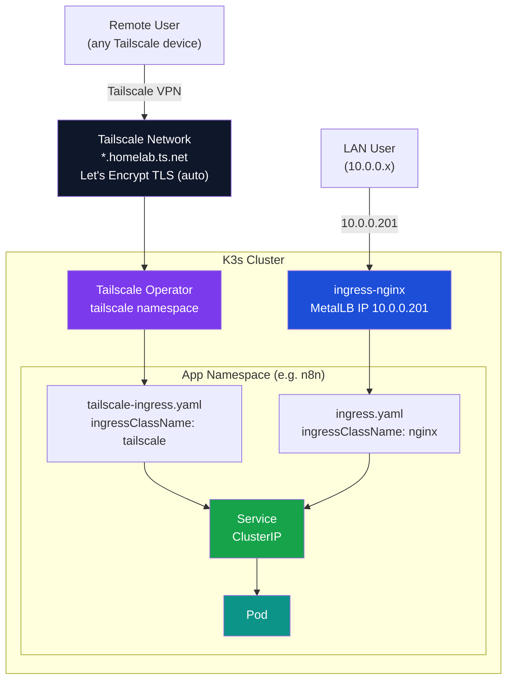

Tailscale Kubernetes Operator research and integration patterns for private homelab ingress with automatic TLS.

## Overview

The Tailscale Kubernetes Operator can replace or complement traditional ingress + cert-manager setups. For a Tailscale-only homelab (no public internet exposure), the operator eliminates the need for Let's Encrypt HTTP-01/DNS-01 challenges entirely.

## Dual Ingress Architecture (Homelab Pattern)



**Access matrix:**

| Path | URL pattern | Requires Tailscale |
|------|-------------|-------------------|
| LAN | `<app>.10.0.0.201.nip.io` | No |
| Remote | `<app>.homelab.ts.net` | Yes |

Available for all Tailscale plans (including free). Installs via Helm chart.

### Capabilities

- Exposes K8s services to the tailnet (private network) -- no public IPs needed
- Provisions TLS certificates automatically (Let's Encrypt-backed `*.ts.net` certs)
- Provides API server proxy for secure `kubectl` access over Tailscale
- Supports ingress, egress, subnet routing, and exit nodes

## Installation

```bash
helm repo add tailscale https://pkgs.tailscale.com/helmcharts
helm repo update
helm upgrade --install tailscale-operator tailscale/tailscale-operator \
  --namespace=tailscale --create-namespace \
  --set-string oauth.clientId=<ID> \
  --set-string oauth.clientSecret=<SECRET> \
  --wait
```

### Requirements

- OAuth client credentials (Tailscale admin console -> Settings -> OAuth clients)
- Scopes: Devices Core, Auth Keys, Services (write)
- Tag: `tag:k8s-operator` (must be defined in tailnet policy file)
- K8s >= v1.23.0

### CRDs Created

| CRD | Purpose |
|-----|---------|
| ProxyGroup | HA proxy deployments (multiple replicas) |
| ProxyClass | Customize proxy behavior |
| Connector | Deploy exit nodes and subnet routers |
| DNSConfig | Manage DNS configuration |
| Recorder | SSH session recording |

## Exposing Services

Three methods are available for exposing services to the tailnet.

### Method 1: Tailscale IngressClass

```yaml
apiVersion: networking.k8s.io/v1
kind: Ingress
metadata:
  name: grafana
spec:
  ingressClassName: tailscale
  defaultBackend:
    service:
      name: grafana
      port:
        number: 80
  tls:
    - hosts:
        - grafana  # becomes grafana.<tailnet>.ts.net
```

- Automatically provisions HTTPS with Let's Encrypt certs for `*.ts.net`
- Requires MagicDNS and HTTPS enabled on the tailnet
- Supports path-based routing (`Prefix` pathType only)
- Only accessible from the tailnet -- no public exposure

### Method 2: LoadBalancer Service (L4 TCP Forwarding)

```yaml
apiVersion: v1
kind: Service
metadata:
  name: my-service
spec:
  type: LoadBalancer
  loadBalancerClass: tailscale
  ports:
    - port: 80
```

This method exposes raw TCP ports (not HTTP). It is the correct approach for non-HTTP protocols such as SSH, databases, or any service that cannot be proxied through an HTTP ingress.

### Method 3: Annotation

```yaml
metadata:
  annotations:
    tailscale.com/expose: "true"
    tailscale.com/hostname: "my-service"  # optional, overrides default
```

Default hostname: `<namespace>-<servicename>`

### Public Exposure (Funnel)

Add `tailscale.com/funnel: "true"` annotation to expose via Tailscale Funnel (public internet). Requires `nodeAttrs` policy granting `funnel` to `tag:k8s`.

## L4 TCP Forwarding

For non-HTTP services (SSH, databases, raw TCP), `ingressClassName: tailscale` (HTTP-only) cannot be used. Instead, use `loadBalancerClass: tailscale` on a standard Kubernetes `Service`. This creates a distinct Tailscale node that forwards TCP connections directly.

### Example: GitLab SSH over Tailscale

GitLab SSH (port 22) exposed to the tailnet as a named Tailscale node:

```yaml
apiVersion: v1
kind: Service
metadata:
  name: gitlab-ssh-tailscale
  namespace: gitlab
  annotations:
    tailscale.com/hostname: "gitlab-ssh"   # becomes gitlab-ssh.homelab.ts.net
spec:
  type: LoadBalancer
  loadBalancerClass: tailscale
  selector:
    app: gitlab                            # must match the GitLab pod labels
  ports:
    - name: ssh
      port: 22
      targetPort: 22
      protocol: TCP
```

**How it works:**

- The Tailscale operator provisions a new device named `gitlab-ssh` on the tailnet
- TCP connections to `gitlab-ssh.homelab.ts.net:22` are forwarded directly to the GitLab pod on port 22
- No HTTP proxying or TLS termination occurs -- the connection is a raw TCP tunnel
- The device name is controlled by `tailscale.com/hostname`; without the annotation, the default is `<namespace>-<servicename>`

**Configuring the application's SSH URL:**

For GitLab, set the SSH host and port in `gitlab.rb` so the UI shows the correct clone URL:

```ruby
gitlab_rails['gitlab_ssh_host'] = 'gitlab-ssh.homelab.ts.net'
gitlab_rails['gitlab_shell_ssh_port'] = 22
```

Without these settings, GitLab shows the internal Kubernetes Service hostname as the SSH URL, which is not reachable from outside the cluster.

**Coexistence with HTTP ingress:**

The `loadBalancerClass: tailscale` Service and the `ingressClassName: tailscale` Ingress create independent Tailscale nodes. Both can exist simultaneously for the same application:

| Resource | Tailscale node | Access pattern |
|----------|---------------|----------------|
| `Ingress` (ingressClassName: tailscale) | `gitlab.homelab.ts.net` | HTTPS web UI |
| `Service` (loadBalancerClass: tailscale) | `gitlab-ssh.homelab.ts.net` | SSH git clone |

## TLS Certificates

Certificates issued for `<hostname>.<tailnet>.ts.net` domains:

- Backed by Let's Encrypt (publicly trusted)
- 90-day validity, auto-renewed around 60 days in
- No port forwarding needed -- Tailscale handles DNS-01 challenge internally
- Requires MagicDNS enabled on the tailnet
- The operator provisions certs automatically for Ingress resources
- Manual: `tailscale cert <hostname>.<tailnet>.ts.net`

**Privacy note:** Certificate hostnames appear in Certificate Transparency (CT) logs. Avoid sensitive names for machines/services.

## API Server Proxy

Exposes kube-apiserver over Tailscale with identity-based RBAC mapping. This enables remote `kubectl` access from any device on the tailnet without VPN or port forwarding.

**Status:** ACTIVE — `tailscale-operator` device registered on tailnet, proxying kubectl traffic.

### Auth Mode (Recommended)

Maps Tailscale identities to Kubernetes impersonation headers.

Identity mapping priority:
1. **Grants** (group -> K8s group): `group:prod` -> `system:masters`
2. **Tags** (device tag -> K8s group): `tag:k8s-readers` -> group `tag:k8s-readers`
3. **User** (tailnet username -> K8s user): `alice@example.com`

### Homelab Configuration

Enabled in the existing Tailscale operator HelmRelease (`kubernetes/platform/controllers/tailscale-operator.yaml`):

```yaml
spec:
  values:
    apiServerProxyConfig:
      mode: "true"  # auth mode — maps Tailscale identity to K8s RBAC
```

RBAC binding (`kubernetes/platform/configs/tailscale-api-rbac.yaml`):

```yaml
apiVersion: rbac.authorization.k8s.io/v1
kind: ClusterRoleBinding
metadata:
  name: tailscale-admin
subjects:
  - kind: User
    name: "admin@example.com"  # Tailscale login identity
    apiGroup: rbac.authorization.k8s.io
roleRef:
  kind: ClusterRole
  name: cluster-admin
  apiGroup: rbac.authorization.k8s.io
```

Tailscale ACL requirements (configured in admin console):

```json
// In "acls" section — allow user to reach the operator
{
  "action": "accept",
  "src": ["admin@example.com"],
  "dst": ["tag:k8s-operator:443"]
}

// In "grants" section (SEPARATE top-level key, NOT inside acls)
{
  "src": ["admin@example.com"],
  "dst": ["tag:k8s-operator"],
  "app": {
    "tailscale.com/cap/kubernetes": [{
      "impersonate": {
        "groups": ["system:masters"]
      }
    }]
  }
}
```

### Using Remote kubectl

Generate the kubeconfig context (one-time):

```bash
tailscale configure kubeconfig tailscale-operator
```

This creates a context named `tailscale-operator.<tailnet>.ts.net` (e.g., `tailscale-operator.homelab.ts.net`).

```bash
# Use the Tailscale proxy context when remote
kubectl --context=tailscale-operator.homelab.ts.net get nodes

# Or set as default context
kubectl config use-context tailscale-operator.homelab.ts.net
```

**Fallback strategy:** If homelab LAN IPs (10.0.0.x) are unreachable (e.g., not on home network), switch to the Tailscale proxy context. If the proxy context also fails, check that the Tailscale operator pod is running and the `tailscale-operator` device is online in the Tailscale admin console.

### Generic Setup (Reference)

```bash
helm upgrade --install tailscale-operator tailscale/tailscale-operator \
  --namespace=tailscale --create-namespace \
  --set-string oauth.clientId=<ID> \
  --set-string oauth.clientSecret=<SECRET> \
  --set-string apiServerProxyConfig.mode="true" --wait
```

Configure kubectl:

```bash
tailscale configure kubeconfig tailscale-operator
```

### Grant Configuration (Tailnet Policy)

```json
{
  "grants": [{
    "src": ["group:admins"],
    "dst": ["tag:k8s-operator"],
    "app": {
      "tailscale.com/cap/kubernetes": [{
        "impersonate": { "groups": ["system:masters"] }
      }]
    }
  }]
}
```

### RBAC Binding

```bash
kubectl create clusterrolebinding tailnet-admins \
  --group="tag:k8s-admins" --clusterrole=cluster-admin
```

### Gotchas

- **Context name uses FQDN**: `tailscale configure kubeconfig` creates context `tailscale-operator.<tailnet>.ts.net`, NOT the shortname `tailscale-operator`
- **Identity must match exactly**: The Tailscale login email in the ClusterRoleBinding MUST match the email shown in `tailscale status --self` — mismatches cause 403 Forbidden
- **`grants` vs `acls`**: These are SEPARATE top-level sections in the Tailscale policy file. The `app` property (for `tailscale.com/cap/kubernetes`) belongs in `grants`, NOT inside `acls`

## High Availability (ProxyGroup)

For production use, deploy multiple proxy replicas:

```yaml
apiVersion: tailscale.com/v1alpha1
kind: ProxyGroup
metadata:
  name: ingress-proxies
spec:
  type: ingress
  replicas: 3
```

Reference in services: `tailscale.com/proxy-group: ingress-proxies`

## Deployment Patterns

### Pattern 1: Tailscale Operator as Sole Ingress (Simplest)

- Replace ingress-nginx + cert-manager with the Tailscale operator
- All services get `*.ts.net` HTTPS certs automatically
- Access only via Tailscale -- no public exposure
- No port forwarding, no DNS provider API keys
- **Trade-off:** Services only accessible when connected to Tailscale

### Pattern 2: Dual Ingress (Tailscale + ingress-nginx)

- Keep ingress-nginx for LAN access (10.0.0.x)
- Add Tailscale operator for remote access with auto-TLS
- Services accessible both on LAN (via MetalLB IP) and remotely (via Tailscale)
- **Trade-off:** More complex, two ingress paths to manage

### Pattern 3: Tailscale as Subnet Router Only

- Keep existing ingress-nginx + cert-manager stack
- Use Tailscale subnet router to access LAN from anywhere
- Access ingress-nginx's MetalLB IP (10.0.0.201) over Tailscale
- **Trade-off:** No auto-TLS from Tailscale, but simplest migration

### Decision Points

| Question | If yes | If no |
|----------|--------|-------|
| Services accessible on LAN without Tailscale? | Keep ingress-nginx | Pattern 1 |
| Browser-trusted TLS on LAN? | Self-signed CA (with browser warning) or Tailscale only | Not needed |
| `kubectl` over Tailscale? | Enable API server proxy | Skip |
| Tailscale dependency acceptable for all access? | Pattern 1 | Pattern 2 or 3 |

## TLS Architecture and Tool Configuration

The homelab has two ingress paths with different cert issuers. Understanding which to use avoids cert trust errors:

| Path | Hostname pattern | TLS cert | Trusted by |
|------|-----------------|----------|-----------|
| LAN (nginx + MetalLB) | `*.10.0.0.201.nip.io` | Homelab self-signed CA | Nothing by default |
| Remote (Tailscale operator) | `*.homelab.ts.net` | Let's Encrypt (via `*.ts.net`) | All browsers/tools |

**Rule: always use Tailscale URLs (`*.homelab.ts.net`) for API clients, MCP tools, and anything that validates TLS certificates.**

### MCP server configuration (`.mcp.json`)

All homelab services that have Tailscale ingresses should use `*.homelab.ts.net` URLs:

```json
{
  "prometheus": { "env": { "PROMETHEUS_URL": "https://prometheus.homelab.ts.net" } },
  "gitlab":     { "env": { "GITLAB_API_URL":  "https://gitlab.homelab.ts.net/api/v4" } }
}
```

Use the Tailscale kubeconfig for K8s and Flux MCP servers (works from both LAN and remote):

```json
{
  "kubernetes": { "env": { "KUBECONFIG": "/home/homelab-admin/.kube/config-homelab" } },
  "flux":       { "env": { "KUBECONFIG": "/home/homelab-admin/.kube/config-homelab" } }
}
```

### OAuth2 Proxy SSO flow

Keycloak uses its Tailscale URL (`https://keycloak.homelab.ts.net`) as the frontend hostname (`KC_HOSTNAME_URL`). This means:

- OIDC tokens are issued with `iss: https://keycloak.homelab.ts.net/auth/realms/homelab`
- The login page (where users type their password) is served at `keycloak.homelab.ts.net` → valid LE cert ✓
- The OAuth2 Proxy callback (`oauth2-proxy.10.0.0.201.nip.io`) still uses the homelab CA cert — this is a pure redirect page with no user interaction

In-cluster pods resolve `keycloak.homelab.ts.net` via a CoreDNS override (`coredns-custom` ConfigMap in `kube-system`) to the MetalLB IP `10.0.0.201`. The nginx ingress accepts requests for this hostname and routes them to Keycloak. `ssl-insecure-skip-verify=true` in OAuth2 Proxy handles the cert mismatch.

### Installing the homelab CA cert (optional, full LAN fix)

To fully eliminate cert warnings on nip.io URLs (e.g., the OAuth2 Proxy redirect pages), install the homelab CA cert once on any machine:

```bash
# Export the CA cert from the cluster
KUBECONFIG=~/.kube/config-homelab kubectl --context=tailscale-operator.homelab.ts.net \
  get secret homelab-ca -n cert-manager \
  -o jsonpath='{.data.tls\.crt}' | base64 -d \
  | sudo tee /usr/local/share/ca-certificates/homelab-ca.crt

# Register it with the system trust store
sudo update-ca-certificates

# Verify: this should return 200 without -k flag
curl https://grafana.10.0.0.201.nip.io/api/health
```

After this, all `*.10.0.0.201.nip.io` services work with trusted certs — browsers, curl, and all CLI tools.

## Environment Variables

| Variable | Purpose |
|----------|---------|
| `TS_AUTHKEY` | Auth key for automatic login |
| `TS_KUBE_SECRET` | Secret name for state storage |
| `TS_ACCEPT_DNS` | Enable MagicDNS in containers |
| `TS_ROUTES` | CIDR ranges for subnet routing |
| `TS_USERSPACE` | Run in userspace mode (no TUN device) |
| `TS_DEST_IP` | ClusterIP for proxy deployments |

## Compatibility

- K8s >= v1.23.0
- Tailscale >= v1.50 for operator annotation-based exposure
- CNI compatible with most plugins; Cilium kube-proxy replacement mode needs socket LB bypass
- OAuth client required (not regular API keys)
